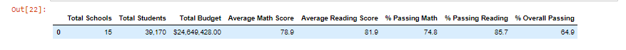
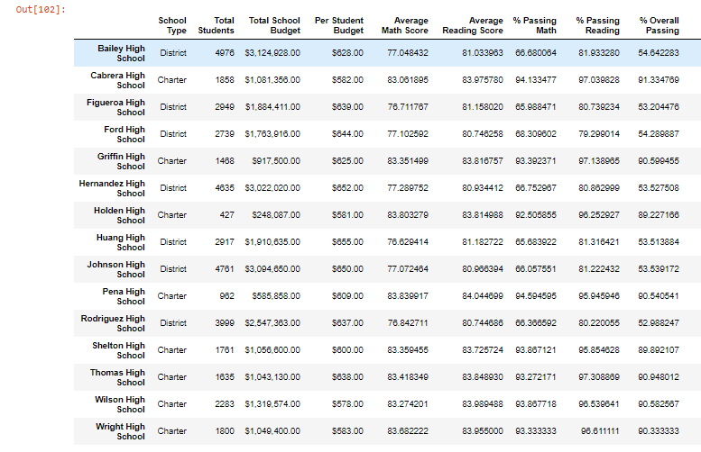
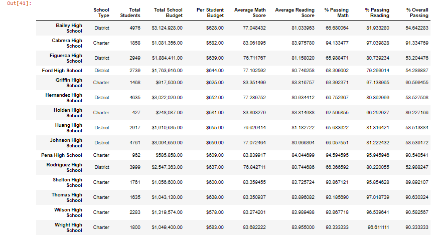
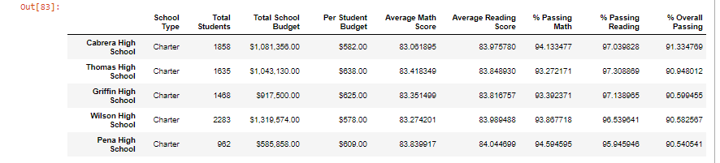
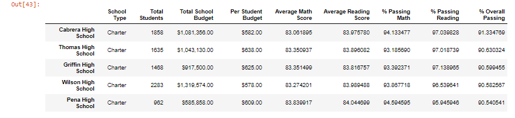

# School District Analysis
Columbia Data Science Module 4
## Overview of Analysis

The school district has tasked me with analyzing standardized test scores in reading and math for the district's high schools. Previously, I had completed this analysis in preparation for a school board meeting to determine next year's funding. For this initial analysis, I calculated the percentage of students passing math, reading, and both tests broken down by high school and grade. Additionaly, I analyzed standardized testing performance based on school size and funding per pupil. After completing this initial analysis, I was notified that academic dishonesty was suspected for 9th grade reading and math scores at Thomas High School. The Board asked me to replace the the suspected compromised test results with NaNs and redo the analysis.

## Results

### District Summary
**Original Analysis**
 

**New Analysis**
 

After removing the suspect data from Thomas High School's 9th grade class, the district's overall statistics changed slightly. Average math score dropped from 79.0 to 78.9, the percentage of students passing math dropped from 75.0% to 74.8%. The average reading score remains relatively unchanged at 81.9, the percentage passing reading declined slightly from 85.8% to 85.7%, and the overall percetage of students in the district passing dropped from 65.2% to 64.9%.

### School Summary
**Original Analysis**
 

**New Analysis**
 

After removing the 9th grade scores, the average math score at Thomas High School dropped from 83.42 to 83.35 and the percent passing math dropped from 93.9% to 93.2%. The average reading score actually rose from 83.85 to 83.90 and the percent passing reading fell from 97.3% to 97.0%. The overall percentage passing dropped from 90.9% to 90.6%.

### Thomas High School's Ranking Relative to Other Schools

Top 5 Schools by Overall Scores in Original Analysis
 

Top 5 Schools by Overall Scores in New Analysis
 
