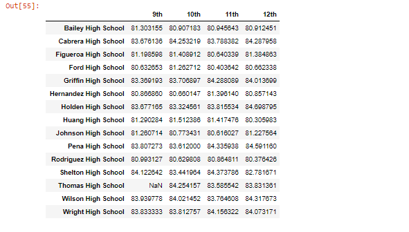

# School District Analysis
Columbia Data Science Module 4
## Overview of Analysis

The school district has tasked me with analyzing standardized test scores in reading and math for the district's high schools. Previously, I had completed this analysis in preparation for a school board meeting to determine next year's funding. For this initial analysis, I calculated the percentage of students passing math, reading, and both tests broken down by high school and grade. Additionally, I analyzed standardized testing performance based on school size and funding per pupil. After completing this initial analysis, I was notified that academic dishonesty was suspected of 9th grade reading and math scores at Thomas High School. The Board asked me to replace the suspected compromised test results with NaNs and redo the analysis.

## Results

### District Summary
* **Original Analysis**

 

* **New Analysis**

 

After removing the suspect data from Thomas High School's 9th grade class, the district's overall statistics changed slightly. Average math score dropped from 79.0 to 78.9, the percentage of students passing math dropped from 75.0% to 74.8%. The average reading score remains relatively unchanged at 81.9, the percentage passing reading declined slightly from 85.8% to 85.7%, and the overall percentage of students in the district passing dropped from 65.2% to 64.9%.

### School Summary
* **Original Analysis**

 

* **New Analysis**

 

After removing the 9th grade scores, the average math score at Thomas High School dropped from 83.42 to 83.35 and the percent passing math dropped from 93.9% to 93.2%. The average reading score actually rose from 83.85 to 83.90 and the percent passing reading fell from 97.3% to 97.0%. The overall percentage passing dropped from 90.9% to 90.6%.

### Thomas High School's Ranking Relative to Other Schools

* **Top 5 Schools by Overall Scores in Original Analysis**

 

* **Top 5 Schools by Overall Scores in New Analysis**

 

Thomas High School's performance relative to other schools was relatively unchanged; it had the second highest overall passing rate in both the original analysis and the new analysis.

### Scores by Grade

#### Math Scores

* **Original Math Scores**

 

* **New Math Scores**

 

#### Reading Scores

* **Original Reading Scores**

* **New Reading Scores**

  

The only difference in math and reading scores by grade is that Thomas High School's 9th Grade data displays as "NaN." (The other numbers differ only due to the number of digits displayed).

### Scores by School Spending
* **Original Scores by Spending**

  

* **New Scores by Spending**

  

Because Thomas High School is in the per pupil spending category of $630-$644, this is the only spending bin to be affected by the change in the dataset. Average math score decreased from 78.52 to 78.50, average reading score increased from 81.62 to 81.63, the percent passing math dropped from 73.48% to 73.46%, the percent passing reading dropped from 84.39% to 84.32%, and the overall percent passing in the category of $630-644 dropped from 62.86% to 62.78%.

### Scores by School Size

* **Original Scores by School Size**

  

* **New Scores by School Size**

 

Because Thomas High School is a medium high school, this is the only category of schools that could be affected. Average math score was not significantly affected, nor was average reading score. The percentage of students passing reading, math, and overall were not significantly affected.

### Scores by School Type

* **Original Scores by School Type**

  

* **New Scores by School Type**

  

Thomas High School is a charter, so this is the category that could potentially be affected by the change in data. However, no significant changes in the data can be observed. 

## Summary
There are four points in the data to highlight. First, changing the 9th grade scores at Thomas High School actually cause average reading scores at the school to rise. This means that even the suspected cheated results were not very high; this is worthy of further research. If teachers/students were faking "realistic" scores, this implies a level of sophistication in the cheating method. Second, the ranking of Thomas High School was unaffected by the change in the data. This fits in with the first point I made: the cheated scores were not radically out of line with the scores of other grades at the same high school. Third, the scores by school spending were relatively unaffected. After the change to the data, the spending bin of $630-$644 had its percentage of pupils passing change by no more than a tenth of a percent. Fourth, average scores for medium-sized schools and charter schools (Thomas is a medium-sized school and a charter school) were basically unchanged in the aggregate. 

-----

### **Contact:**

**Email:** perry.abdulkadir@alumni.harvard.edu

**Linkedin:** https://www.linkedin.com/in/perry-abdulkadir-6a255199/
